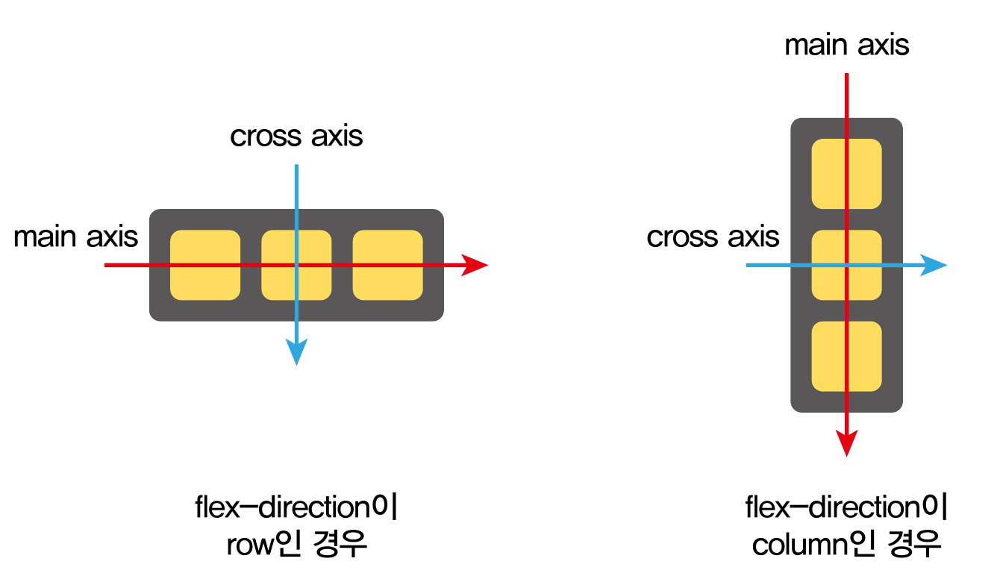
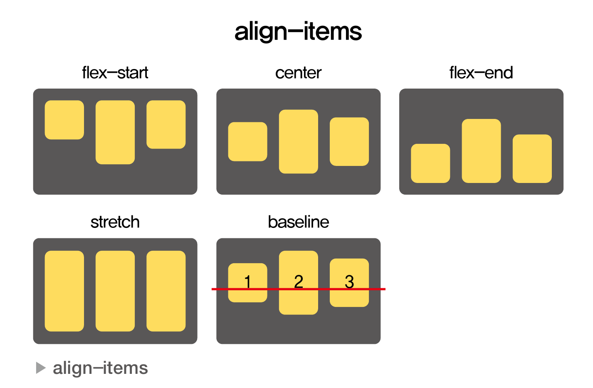
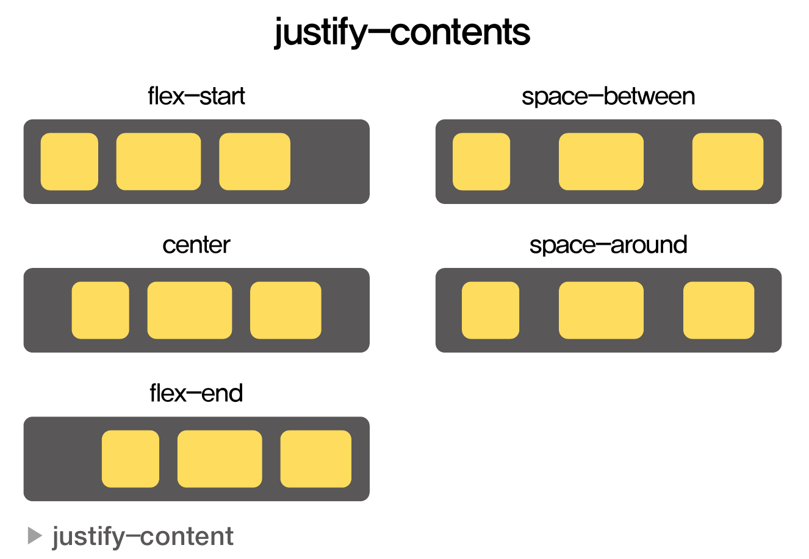

# CSS
- Cascading Style Sheets
    - Cascading: 계단식
- 한 번에 여러 스타일이 적용될 경우에 스타일 충돌을 막기 위해서 계단식으로 스타일이 적용되는 규칙을 갖고 있다.

# CSS 문법과 선택자
- 선택자와 스티일로 구성
    - 선택자를 먼저 씀
    - 이후에 적용할 스타일을 중괄호 안에 `;`(세미콜론)으로 구분하여 하나씩 기술한다.<br>
        ```css
        selector {
            property: value;
            ...
        }
        ```
## selector
- 엘리먼트에 스타일이 적용되는 규칙
- 스타일을 어떤 엘리먼트에 적용할지를 선택하게 해주는 것
- 선택자에 들어갈 수 있는 것
### 1. element selector
- 해당 스타일이 적용될 `HTML element`
```css
h1 {
    color: green;
    font-size: 16px;
}
```
### 2. id selector
- `#` 뒤에 `id`를 넣어 사용
- 고유한 값. 하나의 엘리먼트에 사용해야 한다.
```html
<div id="section">
    ...
</div>
```
```css
#section {
    background-color: black;
}
```
### 3. class selector
- `.` 뒤에 `클래스명`을 넣어서 사용
- 여러 개의 엘리먼트를 분류하기 위해서 사용
```html
<span class="medium">
    ...
</span>
```
```css
.medium {
    font-size: 20px;
}
```

#### 엘리먼트 선택자와 클래스 선택자를 함께 사용하는 경우
> HTML 태그에 클래스가 있는 경우에만 스타일이 적용된다.
```html
<p class="medium">
    ...
</p>
```
```css
p.medium {
    font-size: 20px;
}
```

### 4. universal selector
- 전체 엘리먼트에 적용하기 위한 선택자
```css
* {
    font-size: 20px;
    color: blue;
}
```

### 5. group selector
- 여러 선택자를 그룹으로 묶어 하나의 스타일을 적용하기 위해 사용하는 선택자
```css
h1, h2, p {
    color: black;
    text-align: center;
}
```

### 6. 엘리먼트의 상태와 관련된 선택자
- 상태 예시
    1. 마우스 커서가 엘리먼트 위에 올라온 경우
    2. 엘리먼트가 활성화되어 있는 경우

- 상태와 관련된 선택자
    - `:hover` - 마우스 커서가 엘리먼트 위에 올라왔을 때를 의미
    - `:active` - `<a>`태그에서 사용되는데 엘리먼트가 클릭됐을 때를 의미
    - `:focus` - `<input>` 태그에서 사용되는데, 말그대로 엘리먼트가 초점을 갖고 있는 경우를 의미
    - `:checked` - `radio button`, `checkbox` 같은 유형의 `<input>` 태그가 체크되어 있는 경우
    - `:first-child` - 상위 엘리먼트를 기준으로 첫 번째 child일 경우를 의미
    - `last-child` - 상위 엘리먼트를 기준으로 마지막 child일 경우를 의미
```css
button:hover {
    font-weight: bold;
}

a:active {
    color: red;
}

input:focus {
    color: #000000;
}

option:checked {
    background: #00ff00;
}

p:first-child {
    background: #ff0000;
}

p:last-child {
    background: #ff0000;
}
```

# 속성
## 레이아웃과 관련된 속성
- 레이아웃: 화면에 엘리먼트들을 어떻게 배치할 것인지
- 레이아웃과 관련된 속성
### `display`
- 엘리먼트를 어떻게 표시할지에 관한 속성

    ```css
    div {
        display: none | block | inline | flex;
    }
    ```

    - `display:none;`
        - 엘리먼트를 화면에 숨기기 위해 사용
        - 엘리먼트가 존재하긴 하지만 화면에 보이지 않게 함
        - `공간도 차지하지 않음`
        - 주로 자바스크립트 코드를 넣을 때 사용

    - `display:block;`
        - 블록 단위로 엘리먼트를 배치하는 것
        - 블록 단위: 엘리먼트가 새로운 줄에서 시작하여 위차한 곳 전체의 `width`를 차지한다는 것을 의미
        - 대표적으로 `<p>`, `<div>`, `<h1> ~ <h6>` 태그의 `display`속성 기본값은 `display: block;`

    - `display:inline;`
        - 엘리먼트를 라인 안에 넣는 것
        - 모든 `width`, `height`와 관련된 속성 효과는 없어진다.
        - `<span>` 태그의 `display` 속성 기본값은 `display: inline;`

    - `display:flex;`
        - 엘리먼트 블록 레벨의 플렉스 컨테이너로 표시하는 것
        - 컨테이너이기 때문에 다른 엘리먼트들을 포한함다고 생각하면 됨
        - 하단에 `Flexbox` 설명 참조

### `visibility`
- 엘리먼트를 화면에 보여주거나 감추기 위해 사용하는 속성
    ```css
    div {
        visibility: visible | hidden;
    }
    ```

    - `visibility: visible;`
        - 엘리먼트를 화면에 보이게 함

    - `visibility: hidden;`
        - 엘리먼트를 화면에서 감춤
        - `공간은 그대로 차지`
### `position`
- 엘리먼트를 어떻게 위치시킬 것인가를 정의
    ```css
    div {
        position: static | fixed | relative | absolute;
    }
    ```

    - `position:static;`
        - 기본값
        - 엘리먼트를 원래의 순서대로 위치
    - `position:fixed;`
        - 엘리먼트를 브라우저 `window`에 상대적으로 위치시킨다.
    - `position:relative;`
        - 엘리먼트를 보통의 위치에 상대적으로 위치시킨다.
        - `left: 16px;` 같은 속성을 추가하면 엘리먼트의 왼쪽에 16px의 여백이 추가된다.
    - `position:absolute;`
        - 엘리먼트를 절대 위치에 위치 시킨다.
        - 이때 기준은 첫 번째 위치 지정된 상위 엘리먼트가 된다. (position 속성이 relative, absolute, fixed, 또는 sticky인 상위 엘리먼트)
        - 만약 위치 지정된 상위 엘리먼트가 없다면, 기준은 초기 컨테이닝 블록(보통 `<html> 요소`나 `브라우저 뷰포트`)이 된다.

### 길이
- 값으로는 보통 `px` 또는 `%`를 사용한다.
- `em`, `rem` 등의 단위도 사용 가능하다.
```css 
div {
    width: auto | value;
    height: auto | value;
    min-width: auto | value;
    max-width: auto | value;
    min-height: auto | value;
    max-height: auto | value;
}
```

## Flexbox
- 기존 CSS 레이아웃 사용의 불편한 부분을 개선하기 위해 등장
- `display:flex;`로 설정하면 엘리먼트가 플렉스 컨테이너가 된다.
#### 구성
- 컨테이너
- 아이템

#### 예시
```css
div {
    display: flex;

    flex-direction: row | column | row-reverse | column-reverse;
    align-items: stretch | flex-start | center | flex-end | baseline;
    justify-content: flex-start | center | flex-end | space-between | space-around;
    
}
```

- `flex-direction`
    - `row`: 기본 값. 아이템을 행을 따라 가로 순서대로 왼쪽부터 배치
    - `column`: 아이템을 열을 따라 세로 순서대로 위쪽부터 배치
    - `row-reverse`: 아이템을 행의 역 방향으로 배치
    - `column-reverse`: 아이템을 열의 역방향으로 배치
        
        > `main axis`: `flex-direction`으로 지정된 방향으로 향하는 축<br>
        > `cross axis`: `main axis`를 가로지르는 축<br>

        > `main axis`와 `cross axis`에 따라 `align-items`, `justify-content`의 값의 의미가 달라진다.

- `align-items` - `cross axis`를 기준으로 정렬
    
    - `stretch`: 기본 값. 아이템을 늘려서 컨테이너를 가득 채움
    - `flex-start`: `cross axis`의 시작 지점으로 아이템을 정렬
    - `center`: `cross axis`의 중앙으로 아이템을 정렬
    - `flex-end`: `cross axis`의 끝 지점으로 아이템을 정렬
    - `baseline`: 아이템을 `baseline` 기준으로 정렬

- `justify-content` - `main axis`를 기준으로 아이템들을 어떻게 나란히 맞출지 결정
    
    - `flex-start`: `main axis`의 시작 지점으로 아이템을 맞춤
    - `center`: `main axis`의 중앙으로 아이템을 맞춤
    - `flex-end`: `main axis`의 끝 지점으로 아이템을 맞춤
    - `space-between`
        - `main axis`을 기준으로
            - 첫 아이템은 시작 지점에 맞춤
            - 중간에 있는 아이템들은 사이 간격(between space)이 일정하게 되도록 맞춤
            - 마지막 아이템은 끝 지점에 맞춤
    - `space-around`: `main axis`를 기준으로 아이템의 주변 간격(around space)을 동일하게 맞춤. 여기에서 주변의 의미는 아이템의 시작과 끝을 의미

## 폰트와 관련된 속성
```css
#title {
    font-family: "사용할 글꼴 이름", <일반적인 글꼴 분류>;
    font-size: value;
    font-weight: normal | bold;
    font-style: normal | italic | oblique;
}
```
- `font-family`
    - 공백이 필요한 경우 `" "`로 감싼다.
    - 지정한 글꼴을 찾지 못했을 경우에 fallback 시스템을 통해 글자가 깨지지 않게 한다. `,`로 여러 글꼴을 추가
        - 가장 마지막에 일반적인 글꼴 분류를 적어준다.
- `font-size`
    - 글꼴의 크기
    - `px`, `em`, `rem`, `vw`(viewport width) 등의 단위를 사용
- `font-weight`
    - 글꼴의 두께
    - `bold`, `normal`, `100 ~ 900` 까지의 100단위 숫자
- `font-sytle`
    - 글꼴의 스타일
    - `normal`, `italic`(서체 디자이너가 설계한 고유한 기울임), `oblique`(단순 기울임)

## 자주 사용하는 속성
```css
div {
    background-color: color | transparent;
    border: border-width border-style border-color;
}
```
### 단축 속성 (`background`와 `background-color 차이)
- background는 요소의 배경을 설정하는 여러 속성을 한 줄로 설정할 수 있는 단축 속성(shorthand property)

    ```css
    div {
        background: #ffcc00 url('background.png') no-repeat right top / cover;
    }
    ```
- 반면, background-color는 요소의 배경 색상만을 설정하는 데 사용

    ```css
    div {
        background-color: #ffcc00;
    }
    ```


- `border`도 단축 속성이다.
    ```css
    .border1 {
        border: 2px solid #ffcc00;
    }
    ```